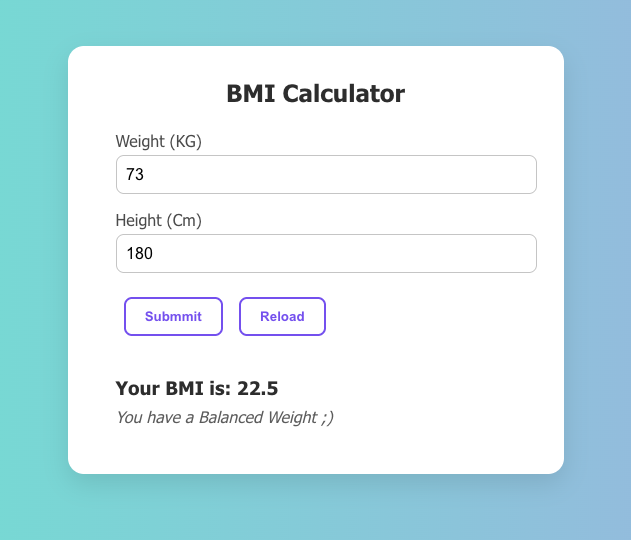

# BMI Calculator

A simple React-based app that calculates Body Mass Index (BMI) using user-provided weight in kilograms and height in centimeters. It gives instant health category feedback based on the BMI result.

---

## Features

- Calculates the bmi according to your weight and height.
- Displays your bmi value and weight condition.
- Clean and minimal UI.
- Responsive design for all screen sizes.

---

## Tech Stack

- HTML, CSS, JavaScript, React.js
- Formula to calculate bmi => [weight / (height / 100) ** 2]

---

## Demo

Check out the live version here [Live Demo](https://dinesh-bazgain.github.io/BMI_Calculator/)

---

## Getting Started

### Prerequisites

- A modern web browser (Chrome, Firefox, etc.)
- Internet connection

### How to Run

- Clone the repo: => git clone https://dinesh-bazgain.github.io/BMI_Calculator/
- Open the folder in code editor.
- In the terminal change the path to current working directory.
- Type "npm start" and hit enter.
- Copy the localhost link provided and paste in any browser and enjoy.

### Usage

- Enter your body weight and height.
- Click the submmit button or click the reload if you enter the incorrect value.
- Get your BMI value and weight status instantly!

### Known Issues

- No option to enter the value in different units.
- Styling may vary across older browsers.
- UI could be improved for accessibility

### Future Improvements

- Add the option to enter the value in different inits.
- Dark/light mode toggle.

---

## License

MIT License © 2025 Dinesh Bajgain

---

## Contact

Feel free to reach out to me via [email](dinesh.bazgain@gmail.com) or open an issue on GitHub!

---

### Happy coding and converting!!!

